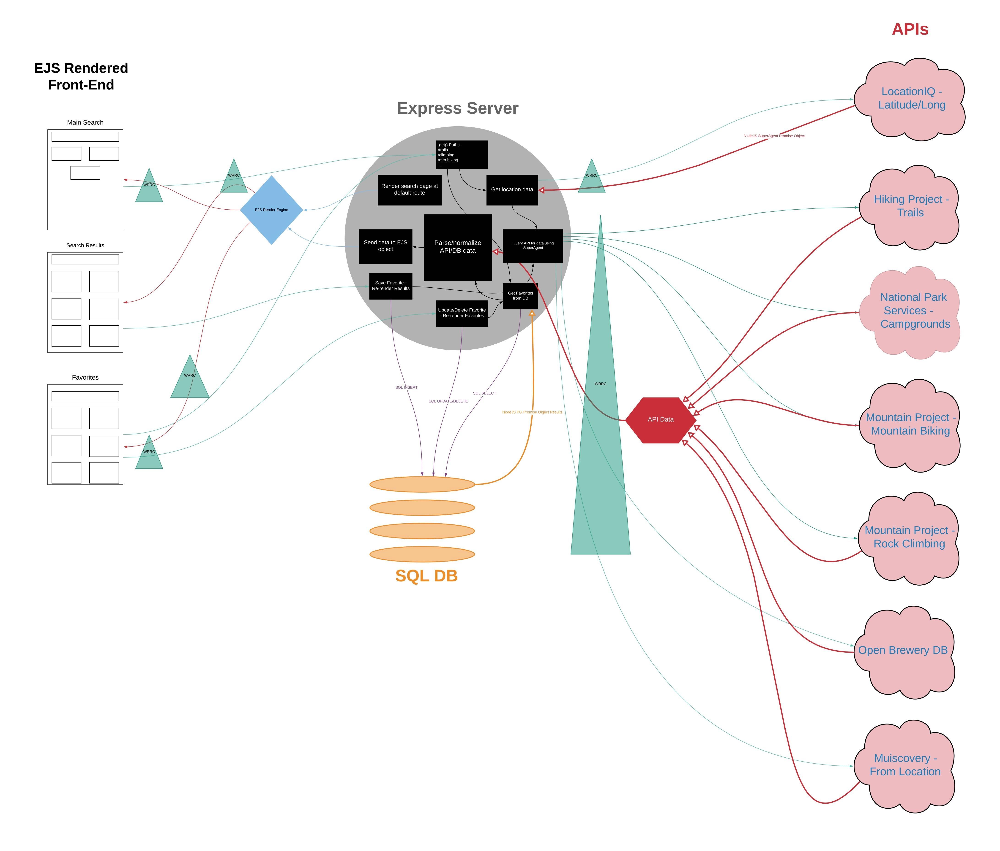

# Weekend Warrior
Code 301 Final Project

## Created by: Christopher Hamersly, Paul Rest, Stephen Baldock, and Daisy Johnson

## Overall problem domain and how this project solves those problems:
The user has a limited amount of time and wants to get the most out their weekend. This app gives you options to fill up the time you have available, whether it be a lot or a little making you a true weekend warrior. This website will be a one-stop-shop to give all the information you need like trail guides, playlists that match your adventure and restaurant recommendations etc.

## summary of project: A web-app to help you figure out the best way to spend your weekend outside.

## Version
1.0 - Server Setup
1.1 - Three CORE API deployment
1.2 - CRUD capability
1.3 - Additional API deployment
1.4 - Full CRUD capability

## Architecture
Backend utilizes superagent for API calls to googlebooks API and postgres to query a SQL database. Frontend is served with EJS components.

## WireFrame

## Domain Model

## Libraries Used:
 - Express
 - EJS
 - dotenv
 - superagent
 - pg
 
 ## API Endpoints
**Location IQ API**
https://us1.locationiq.com/v1/search.php
**Climbing Routes API by lat & lon**
https://www.mountainproject.com/data/get-routes-for-lat-lon?lat=40.03&lon=-105.25&maxDistance=10&minDiff=5.6&maxDiff=5.10&key=200790534-05370a505ab38e493dbb8b4c24c7dadd
**Hiking Routes API by lat & lon**
https://www.hikingproject.com/data/get-trails?lat=40.0274&lon=-105.2519&maxDistance=10&key=200790534-badad5b9f2f1c28cff7c1bd0f669131e
**Trail Running API by lat & lon**
https://www.trailrunproject.com/data/get-trails?lat=40.0274&lon=-105.2519&maxDistance=10&key=200790534-badad5b9f2f1c28cff7c1bd0f669131e
**Mountain Biking API by lat & lon**
https://www.mtbproject.com/data/get-trails 
**Camping API by lat & lon**
https://developer.nps.gov/api/v1/parks
**Breweries by lat & lon**
https://api.openbrewerydb.org/breweries'
**Local Music by lat & lon**
http://musicovery.com/api/V6/artist.php?fct=getfromlocation 

## Example API Response - Location IQ
  {
    place_id: '235549103',
    licence: 'https://locationiq.com/attribution',
    osm_type: 'relation',
    osm_id: '237385',
    boundingbox: [ '47.4810022', '47.7341357', '-122.459696', '-122.224433' ],
    lat: '47.6038321',
    lon: '-122.3300624',
    display_name: 'Seattle, King County, Washington, USA',
    class: 'place',
    type: 'city',
    importance: 0.78297917356438,
    icon: 'https://locationiq.org/static/images/mapicons/poi_place_city.p.20.png'
  }
## Example API Response - Hiking
   {
      id: 7031994,
      name: 'Shore Loop Road',
      type: 'Trail',
      summary: 'A beautiful city park that offers views of downtown Seattle and Mt. Rainier.',
      difficulty: 'green',
      stars: 4.4,
      starVotes: 11,
      location: 'Mercer Island, Washington',
      url: 'https://www.hikingproject.com/trail/7031994/shore-loop-road',
      imgSqSmall: 'https://cdn2.apstatic.com/photos/hike/7032902_sqsmall_1554996783.jpg',
      imgSmall: 'https://cdn2.apstatic.com/photos/hike/7032902_small_1554996783.jpg',
      imgSmallMed: 'https://cdn2.apstatic.com/photos/hike/7032902_smallMed_1554996783.jpg',
      imgMedium: 'https://cdn2.apstatic.com/photos/hike/7032902_medium_1554996783.jpg',
      length: 2.5,
      ascent: 133,
      descent: -134,
      high: 91,
      low: 22,
      longitude: -122.2572,
      latitude: 47.5513,
      conditionStatus: 'All Clear',
      conditionDetails: 'Dry',
      conditionDate: '2020-06-16 21:21:35' 
    },
    
  ## Example API Response - Camping
  {
    contacts: { phoneNumbers: [Array], emailAddresses: [Array] },
    states: 'CA',
    longitude: '-122.1326097',
    activities: [
      [Object], [Object],
      [Object], [Object],
      [Object], [Object],
      [Object]
    ],
    entranceFees: [ [Object] ],
    directionsInfo: 'Please visit our main website for specific directions to our park. You may call the John Muir Visitor Center for additional information.',
    entrancePasses: [ [Object] ],
    directionsUrl: 'http://www.nps.gov/jomu/planyourvisit/directions.htm',
    url: 'https://www.nps.gov/jomu/index.htm',
    weatherInfo: 'The Mediterranean climate of Martinez features hot, dry summers with lower temperatures near 60º F and upper temperatures near 100º F. The heat gives way to cool, rainy winters with lows near 45º F and highs near 75º F. Fall and spring can bring rain and temperatures from 55-80º F.\n' +
      '\n' +
      'March to April: wet/dry, 60-80º F\n' +
      'May to September: very dry, 60-100º+ F\n' +
      'October to November: dry/wet, 55-80º F\n' +
      'December to February: wet, 45-75º F',
    name: 'John Muir',
    operatingHours: [ [Object] ],
    topics: [
      [Object], [Object],
      [Object], [Object],
      [Object], [Object],
      [Object]
    ],
    latLong: 'lat:37.9828422, long:-122.1326097',
    description: 'John Muir played many roles in his life, all of which helped him succeed in his role as an advocate for Nature. As America's most famous naturalist and conservationist, Muir fought to protect the wild places he loved, places we can still visit today. Muir's writings convinced the U.S. government to protect Yosemite, Sequoia, Grand Canyon and Mt. Rainier as national parks.',
    images: [ [Object] ],
    designation: 'National Historic Site',
    parkCode: 'jomu',
    addresses: [ [Object], [Object] ],
    id: 'F339067B-A588-4BF3-9D90-1C1BA1249203',
    fullName: 'John Muir National Historic Site',
    latitude: '37.9828422'
  },
12:20
Mtn biking:
    {
      id: 7017829,
      name: 'Crown Zellerbach Trail',
      type: 'Trail',
      summary: 'A somewhat rough and rowdy rail-to-trail that starts in Scappoose and climbs towards Vernonia.',
      difficulty: 'greenBlue',
      stars: 3.5,
      starVotes: 12,
      location: 'Scappoose, Oregon',
      url: 'https://www.mtbproject.com/trail/7017829/crown-zellerbach-trail',
      imgSqSmall: 'https://cdn2.apstatic.com/photos/mtb/7033462_sqsmall_1570070165.jpg',
      imgSmall: 'https://cdn2.apstatic.com/photos/mtb/7033462_small_1570070165.jpg',
      imgSmallMed: 'https://cdn2.apstatic.com/photos/mtb/7033462_smallMed_1570070165.jpg',
      imgMedium: 'https://cdn2.apstatic.com/photos/mtb/7033462_medium_1570070165.jpg',
      length: 22.5,
      ascent: 1827,
      descent: -1199,
      high: 1268,
      low: 14,
      longitude: -122.8409,
      latitude: 45.7454,
      conditionStatus: 'Unknown',
      conditionDetails: null,
      conditionDate: '1970-01-01 00:00:00'
    }
    
  ## Example API Response - Mountain Biking
    {
      id: 7017829,
      name: 'Crown Zellerbach Trail',
      type: 'Trail',
      summary: 'A somewhat rough and rowdy rail-to-trail that starts in Scappoose and climbs towards Vernonia.',
      difficulty: 'greenBlue',
      stars: 3.5,
      starVotes: 12,
      location: 'Scappoose, Oregon',
      url: 'https://www.mtbproject.com/trail/7017829/crown-zellerbach-trail',
      imgSqSmall: 'https://cdn2.apstatic.com/photos/mtb/7033462_sqsmall_1570070165.jpg',
      imgSmall: 'https://cdn2.apstatic.com/photos/mtb/7033462_small_1570070165.jpg',
      imgSmallMed: 'https://cdn2.apstatic.com/photos/mtb/7033462_smallMed_1570070165.jpg',
      imgMedium: 'https://cdn2.apstatic.com/photos/mtb/7033462_medium_1570070165.jpg',
      length: 22.5,
      ascent: 1827,
      descent: -1199,
      high: 1268,
      low: 14,
      longitude: -122.8409,
      latitude: 45.7454,
      conditionStatus: 'Unknown',
      conditionDetails: null,
      conditionDate: '1970-01-01 00:00:00'
    }
  
    
   ## Example API Response - Rock Climbing
       {
      id: 109589293,
      name: 'Webelo',
      type: 'Sport',
      rating: '5.12d',
      stars: 4,
      starVotes: 1,
      pitches: '',
      location: [Array],
      url: 'https://www.mountainproject.com/route/109589293/webelo',
      imgSqSmall: 'https://cdn2.apstatic.com/photos/climb/109589315_sqsmall_1494357378.jpg',
      imgSmall: 'https://cdn2.apstatic.com/photos/climb/109589315_small_1494357378.jpg',
      imgSmallMed: 'https://cdn2.apstatic.com/photos/climb/109589315_smallMed_1494357378.jpg',
      imgMedium: 'https://cdn2.apstatic.com/photos/climb/109589315_medium_1494357378.jpg',
      longitude: -122.2833,
      latitude: 47.6768
    },
    
  ## Example API Response - Brewery
    {
    id: 7405,
    name: 'Cloudburst Brewing',
    brewery_type: 'micro',
    street: '2116 Western Ave',
    city: 'Seattle',
    state: 'Washington',
    postal_code: '98121-2110',
    country: 'United States',
    longitude: '-122.3452717',
    latitude: '47.6116138',
    phone: '2066026061',
    website_url: 'http://www.cloudburstbrew.com',
    updated_at: '2018-08-24T16:33:34.739Z',
    tag_list: []
  },
  
## Example API Response - Music
  {
    mbid: '364e1151-40f0-476d-a437-8fc6427262e8',
    name: 'Acceptance',
    genre: 'rock',
    country: 'USA',
    continent: 'America',
    region: 'Washington',
    city: 'Seattle'
  },
    
## Database Relationship Diagram
SQL Tables - MVP
* **Hiking**
 * Key | Image | Trail Name | Summary | Latitude | Longitude | Distance | Total Elevation | Max Height | Difficulty Rating | Condition Status | Reviews 
* **Camping**
 * Key | Image | Campground Name | Latitude | Longitude | Description | Firewood | Restrooms | Reservations | Fees | Potable Water | Accessibility
* **Rock Climbing**
 * Key | Image | Name | Latitude | Longitude | Type | Pitches | Stars 
* **Location ID**
 * Key | Search_Query | Formatted_Query | Latitude | Longitude
 
 ## Database Schemas
 CREATE TABLE locations (
  "id" SERIAL PRIMARY KEY,
  "search_query" VARCHAR(255),
  "display_name" VARCHAR(255),
  "lat" DECIMAL(12, 9),
  "lon" DECIMAL(12, 9)
);

DROP TABLE IF EXISTS trails;

CREATE TABLE trails (
  "id" SERIAL PRIMARY KEY,
  "api_id" VARCHAR(255),
  "name" VARCHAR(255),
  "summary" VARCHAR(10000),
  "img_medium" VARCHAR(1000),
  "latitude" VARCHAR(255),
  "longitude" VARCHAR(255),
  "length" VARCHAR(255),
  "ascent" VARCHAR(255),
  "high" VARCHAR(255),
  "difficulty" VARCHAR(255),
  "conditionstatus" VARCHAR(255),
  "stars" VARCHAR(255),
  "notes" VARCHAR(10000)
);

DROP TABLE IF EXISTS camping; 

CREATE TABLE camping (
  "id" SERIAL PRIMARY KEY,
  "api_id" VARCHAR(255),
  "image" VARCHAR(255),
  "name" VARCHAR(255),
  "latitude" DECIMAL(12, 9),
  "longitude" DECIMAL(12, 9),
  "description" VARCHAR(10000),
  "entrance_fees" VARCHAR(10000),
  "activities" VARCHAR(10000),
  "notes" VARCHAR(10000)
);

DROP TABLE IF EXISTS climbing;

CREATE TABLE climbing (
  "id" SERIAL PRIMARY KEY,
  "api_id" VARCHAR(255),
  "location" VARCHAR(255),
  "name" VARCHAR(255),
  "type" VARCHAR(255),
  "pitches" VARCHAR(255),
  "stars" VARCHAR(255),
  "latitude" DECIMAL(12, 9),
  "longitude" DECIMAL(12, 9),
  "img_medium" VARCHAR(255),
  "notes" VARCHAR(10000)
);

DROP TABLE IF EXISTS mtn_biking;

CREATE TABLE mtn_biking (
  "id" SERIAL PRIMARY KEY,
  "api_id" VARCHAR(255), 
  "location" VARCHAR(255),
  "name" VARCHAR(255),
  "type" VARCHAR(255),
  "difficulty" VARCHAR(255),
  "stars" VARCHAR(255),
  "latitude" DECIMAL(12, 9),
  "longitude" DECIMAL(12, 9),
  "img_medium" VARCHAR(255),
  "summary" VARCHAR(10000),
  "length" VARCHAR(255),
  "notes" VARCHAR(10000)
);

DROP TABLE IF EXISTS breweries;

CREATE TABLE breweries (
  "id" SERIAL PRIMARY KEY,
  "api_id" VARCHAR(255),
  "name" VARCHAR(255),
  "latitude" DECIMAL(12, 9),
  "longitude" DECIMAL(12, 9),
  "type" VARCHAR(255),
  "website" VARCHAR(255),
  "notes" VARCHAR(10000)
);

